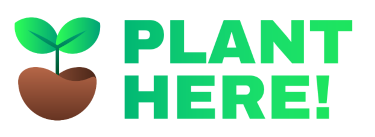
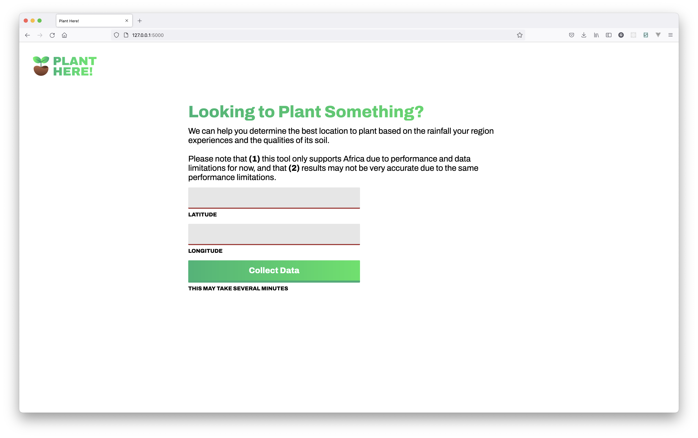

# Plant Here!

This simple application allows users to determine whether their location would be a good place to plant by collecting rainfall data and soild data for their region. Right now we are using Flask, but we will most likely be using a different framework soon.

## Prerequisites

You'll need Python version 3.6 or above (newest version preferable). You'll also need to install several libraries through the application's virtual environment.

## Installation Instructions

1. Download or clone the repository
2. Using your terminal, change your directory to the repository
3. Create the virtual environment with `source env/bin/activate`
4. Install the required packages using `pip install -r requirements.txt`
5. Tell Flask where to find the application with `export FLASK_APP=app`
6. Switch to development mode using `export FLASK_ENV=development`
7. And finally, run the application with `flask run`

**Please note!** Although the application is now running, the data (which is stored locally) still needs to be retrieved first. Follow these instructions to download that data

1. Change your directory to the repository using your terminal and type in `jupyter notebook` (you will need to have Jupyter Notebook installed)
2. Create a new directory called "africa-rainfall" within the repository
3. Open `DataCollectionForFullYear.ipynb` using Jupyter Notebook in your web browser
4. Run all cells to collect the rainfall data from the AWS S3 bucket [here](https://aws.amazon.com/marketplace/pp/prodview-wwjxc5sort6dw?sr=0-17&ref_=beagle&applicationId=AWSMPContessa#resources)

## Screenshots

